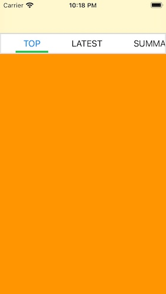
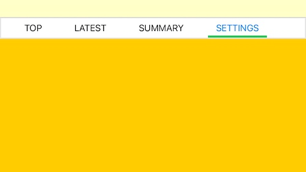
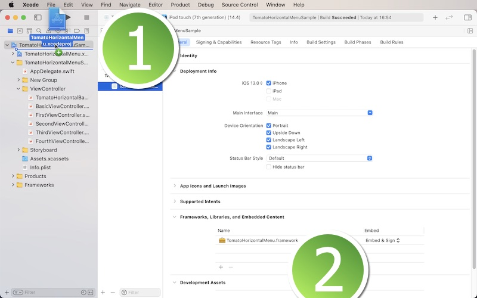

# TomatoHorizontalMenu Framework

<h2>Development and compatibility</h2>

Development platform: iOS 
Language: Swift 
Compatibility: iOS 13 or greater 

<h2>Description</h2>

TomatoHorizontalMenu lets you create a horizontally-scrollable menu right below the navigation controller for switching from one view controller to another.  The following is a list of features.

<ol>
<li>List any number of tappable labels, each of which can be directed to a specific view controller.</li>
<li>The default height of the horizontal menu is 60 points and can be flexible.</li>
<li>The default space between the tappable labels is 30 points can be flexible.</li>
<li>You have options of letting the framework set auto layout such that the horizontal menu will automatically adjust when the device is lotated.</li>
<li>You can customize the highlighted label text color and non-highlighted label text color.</li>
</ol>

<h2>Installation</h2>

1. In order to use this framework, download the sample project.  You will find the folder titled **TomatoHorizontalMenu Framework**.  Locate the Xcode file inside.  And put this Xcode file in your Xcode project.  Select your target and make sure you have **TomatoHorizontalMenu** under General > Framworks, Libraries, and Embeded Content as shown below.

2. Create a sub-class of **UIViewController**.  Name it BasicViewController, BaseViewController, RootViewController or whatever you want such that all view controllers can be based on.  For now, let us call this base view controller **BasicViewController**.  Import **TomatoHorizontalMenu** to the view controller.

3. In the base view controller, create a function to set up the menu.  Let us call this function **setup**.  Also create **override** function named **switchViewController**.

4. In the setup function, create an array of menu models with **TomatoHorizontalMenuModel**.  This struct takes two properties: name (String) and index (Int).  The name property is the name of a sub-menu that appears on the horizontal menu.  Each sub-menu is supposed to point to a specific view controller.  The index property determines the order of appearance.

5. Use the switchViewController function to read sender view's tag to direct the app to a specific view controller.  The following is an example.

override func switchViewController(_ sender: UITapGestureRecognizer) {
	if let tag = sender.view?.tag {
		if tag == 0 {
			if let viewController = UIStoryboard.init(name: "Main", bundle: nil).instantiateViewController(withIdentifier: "FirstViewController") as? FirstViewController {
				navigationController?.pushViewController(viewController, animated: true)
			}
		}
		...
		...
		...
	}
}

6. In each view controller to which the app is directed to, change the class to BasicViewController.  In its **viewDidLoad** method, set an integer (tag) to **viewIndex**.  Also, call the setup function.

<h2>Variables</h2>

<li>menuHeight: It's the height of the horizontal menu.  The default height is 60 points.</li>
<li>labelTextColor: It's the text color over the sub-menu.</li>
<li>labelHighlightTextColor: It's the text color over the sub-menu for the currently-selected view controller.</li>
<li>labelHeight: It's the height of the text label over the sub-menu.</li>
<li>labelFontSize: It's the font size of the text label over the sub-menu.</li>
<li>menuHighlightColor: It's the color of the sub-menu for the currently-selected view controller.</li>
<li>menuHighlightHeight: It's the height of the horizontal hightlight line.</li>
<li>spaceBetween: It's the space between two sub-menus.</li>
<li>boxBorderColor: It's the border color around the horizontal scroll view.</li>
<li>borderWidth: It's the weight of the border around the horizontal scroll view.</li>
<li>showHorizontalScroller: It's a boolean value as to whether or not to show the horizontal scroller.</li>
<li>scrollBackColor: It's the background color of the horizontal scroll view.</li>
<li>hasLayoutConstraints: Set it to true if you want the framework to set autolayout constraints.</li>
<li>autoScroll: If you set it to true, the selected sub-menu will appear to the left after the user switches view controllers.</li>

